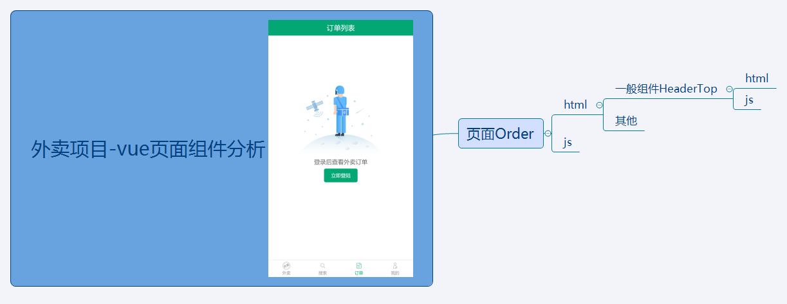

# tutu

前后端分离项目（移动端）

**你能得到什么？**

* 学习到vue全家桶的大部分知识
* 前后台交互（ajax、api接口、mock数据）

## 前端（移动端）

> vue全家桶（vue-cli、vueRouter、vuex、mintui等）
>
> 配套视频：https://www.bilibili.com/video/BV1Lp411d7w4
>
> 在目录ttshop-client下为前端页面的根目录

## 简介

> 

## 后端（nodejs）

>在目录ttshop-server_final下为后端的根目录

## Build Setup

``` bash
# install dependencies（分别在前后端的根目录下安装依赖，安装较慢，可能会失败，重新安装就好了）
npm install

#Turn on the back end service （在后端目录ttshop-server_final下开启后端服务）
npm start

# serve with hot reload at localhost:8080（在前端根目ttshop-client/config/index.js可以查看相关配置，开发环境运行）
npm run dev

# build for production with minification（生产环境运行）
npm run build

# build for production and view the bundle analyzer report
npm run build --report

# run unit tests
npm run unit

# run e2e tests
npm run e2e

# run all tests
npm test
```

For a detailed explanation on how things work, check out the [guide](http://vuejs-templates.github.io/webpack/) and [docs for vue-loader](http://vuejs.github.io/vue-loader).

:smiling_imp:**前后端分别放在两个同级文件夹下**

## 截图

<video src="./ttshop-client/static/res/Video_2021-07-12_155104.wmv" controls="controls" width="500" height="300">您的浏览器不支持播放该视频！</video>


## 细节


​	





## 性能优化

……

## 总结

……
